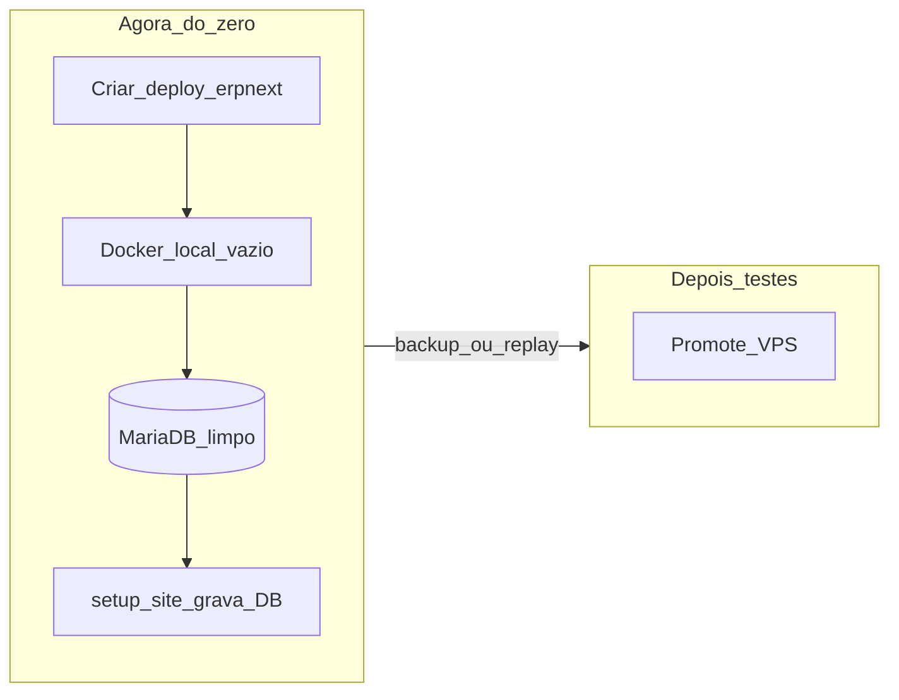

# Plano: ERPNext do zero (ecossistema unificado)

## Para o agente do próximo chat — leia primeiro

Este plano é **partida do zero**. Não assuma que já existem `deploy/erpnext/`, `apps/elerp_pos/`, containers ERPNext ou bootstrap. Se algo com esses nomes aparecer no disco, trate como lixo a substituir ou confirme com o usuário antes de apagar volumes.

**Estado atual do repo elERP (legado, não é o ERPNext):**

- App Pages + Supabase em produção: PDV açaí (g/kg), caixa, estoque, etc.
- **Não há** stack ERPNext neste repositório ainda.
- Trabalho imediato = **criar** a pasta de deploy + subir Docker local + banco limpo.

**Ordem obrigatória:** `zero-scaffold` → `local-docker` → `db-only-setup` → `app-elerp-pos` → `local-test-loop`. Só então migração / VPS / cutover / fiscal.

**Não fazer neste momento:** cutover produção, VPS, alterar o PDV Pages como fonte da verdade, hardcode de produtos.

---

## Premissas (fechadas)

- **Um site Frappe / uma instância ERPNext** — várias Companies (finalidades).
- **Local-first:** tudo sobe e testa em Docker local. Destino (VPS) só com roteiro local verde.
- **Zero hardcode:** produtos, preços, empresas, UOM, pagamentos, usuários, estoque, FO, POS Profile **só no MariaDB**. Bootstrap grava no banco; runtime só lê/escreve DocTypes.
- **Self-host** via [frappe_docker](https://github.com/frappe/frappe_docker) — licença R$ 0.
- **Companies iniciais (criadas no DB):** `Holding FO` + `Loja Acai` (parent Holding).
- **elERP Pages** continua produção até cutover futuro; o laboratório é o ERPNext local.
- **ERPNext v15 LTS** + apps pinados.



---

## Princípio: tudo junto ao banco

| Proibido | Obrigatório |
|---|---|
| Listas de produtos/preços/empresas no código | `frappe.get_doc` / `get_all` / ORM |
| Demo seed no source | Fixture ou `setup_site.py` que **insere** DocTypes se faltarem |
| CNPJ/caixa só em env de app | Company / POS Profile / Mode of Payment no MariaDB |
| Catálogo no front | Item via UI/import/migração → `tabItem` |

Bootstrap = script idempotente **uma vez**; fonte em runtime = MariaDB.

---

## 1. Arquitetura

| Finalidade | Company | Módulos |
|---|---|---|
| Family Office | `Holding FO` | Accounting, Assets, Budget, Journal, Consolidated |
| Loja açaí | `Loja Acai` | Selling, Stock, Buying, POS, Payments |
| Futuras | novas Companies filhas | Mesmo playbook |

Segregação por Company no DB; Item Groups `ACAI-*` vs `FO-*`; roles POS User vs Accounts Manager.

---

## 2. Passo zero — scaffold no repo (primeiro commit útil)

Criar do nada:

```
deploy/erpnext/
  apps.json                 # erpnext version-15 (+ elerp_pos quando existir)
  compose.override.local.yml
  .env.example
  README.md                 # como subir do zero no local
  scripts/setup_site.py     # bootstrap → MariaDB
  scripts/backup.sh
  scripts/restore.sh
  scripts/promote.md        # local → VPS (preencher; não executar agora)
  tests/roteiro-local.md
apps/elerp_pos/             # scaffold vazio na fase do app (ou depois do site base)
```

`apps.json` inicial mínimo:

```json
[
  { "url": "https://github.com/frappe/erpnext", "branch": "version-15" }
]
```

Incluir `elerp_pos` no `apps.json` só após o scaffold do app existir (path/git).

---

## 3. Docker local (do zero)

1. Pré-requisitos: Docker Engine/Compose, ~8 GB RAM para Docker, portas livres.
2. Seguir README em `deploy/erpnext/` baseado em frappe_docker (pwd.yml + override local).
3. Build imagem; create-site; install erpnext.
4. Locale site: `pt-BR`, timezone `America/Sao_Paulo`, currency `BRL`.
5. Abrir UI; login Administrator; **banco vazio de negócio** (sem produtos).
6. Volumes nomeados — dados sobrevivem a `compose restart`.
7. Validar `backup.sh` / `restore.sh` uma vez em local.

Site sugerido: `erp.localhost` (ou o padrão do compose documentado no README).

---

## 4. Bootstrap no MariaDB (`setup_site.py`)

Idempotente; só grava se não existir:

1. Company `Holding FO` + chart.
2. Company `Loja Acai` (parent Holding) + chart.
3. Cost Centers, Warehouses da Loja, Price List, Modes of Payment (Dinheiro/PIX/Cartão) → contas no DB.
4. POS Profile `Caixa Principal`.
5. Roles / User Permissions de exemplo (sem inventar produtos).

Nenhum Item de sabor no bootstrap.

---

## 5. App `elerp_pos` (do zero, sem seeds)

- Custom Fields no Item (`sell_by_weight`, etc.) via migrate.
- POS: g → kg via UOM Conversion **do banco**; preço via Item Price **do banco**.
- Print Format cupom lendo Company do DB.
- **Zero** sabores/preços no repositório.

---

## 6. Roteiro de testes locais (bloqueia VPS)

1. Cadastrar Item+Price pela UI — sobrevive a restart dos containers.
2. POS Opening → venda 350 g → total = 0,35 × preço/kg → estoque baixa.
3. Pagamento misto + troco.
4. POS Closing coerente.
5. PO → receive → estoque sobe.
6. User caixa sem acesso Holding.
7. Journal FO só na Holding.
8. `compose down/up` — dados intactos.
9. Backup + restore em site limpo local — smoke OK.

---

## 7. Depois do verde local (não começar por aqui)

- Migração amostra Supabase → MariaDB (scripts ORM).
- Promote VPS (mesmo apps.json / restore).
- Paralelo + cutover; elERP read-only.
- Fiscal BR + A1.

---

## 8. O que NÃO fazer

- Assumir que ERPNext já está instalado neste repo.
- Hardcode de produtos/empresas/preços.
- Subir VPS antes do roteiro §6.
- Cutover do elERP no primeiro dia.
- Rodar ERPNext no GitHub Pages.
- Patch no core ERPNext.

---

## 9. Critérios de pronto (local = meta do primeiro ciclo)

- Pastas `deploy/erpnext/` e site Docker criados **neste ciclo**, não herdados.
- Login OK; bootstrap só no DB; roteiro §6 100%.
- Nenhum seed de produto no git.
- Destino/VPS explícitamente **fora** do escopo até o usuário pedir a fase seguinte.

---

## 10. Primeira mensagem útil no próximo chat

Objetivo sugerido ao agente: *“Execute o plano ERPNext do zero: comece por `zero-scaffold` + `local-docker` em `deploy/erpnext/`. Não mexa em cutover/VPS. Zero hardcode; tudo no MariaDB.”*
